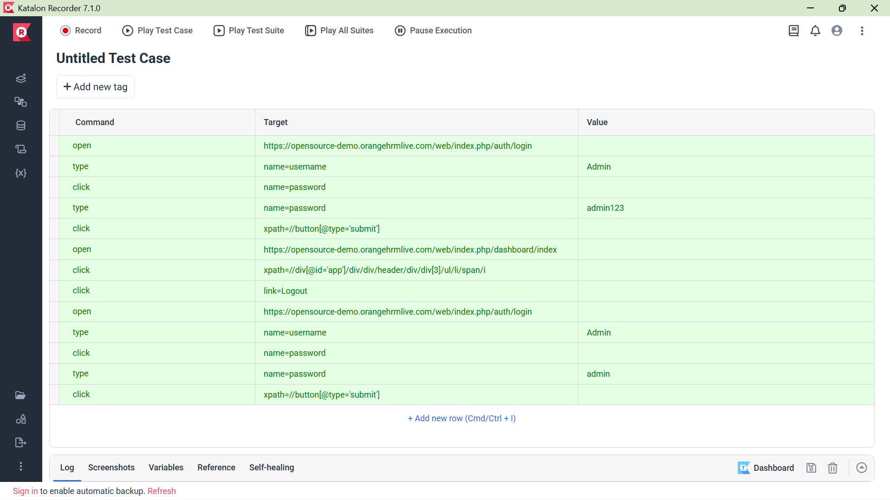

# Part 1: Theoretical Analysis

### Q1: AI-Driven Code Generation Tools
**Time Reduction:**
- Context-aware autocompletion suggests entire code blocks.
- Reduces syntax errors and typos.  
- Faster API/library discovery.  

**Limitations:**
- May suggest vulnerable or inefficient code.  
- Lacks understanding of broader architecture.
---

### Q2: Supervised vs. Unsupervised Learning for Bug Detection
**Supervised Learning:**
- Uses labeled datasets (buggy/non-buggy code).  
- Predicts known bug types.  
- High accuracy for familiar patterns.  
- Requires extensive labeled data. 

**Unsupervised Learning:**
- Finds patterns without labels. 
- Detects novel/anomalous bugs.  
- No labeling costs.
- Higher false positives, harder to interpret.  
---

### Q3: Why is Bias Mitigation critical in UX Personalization?
- Prevents discrimination against user groups.   
- Mitigates business and reputational risks.  
- Ensures fair content distribution.  
---

## 2. Case Study Analysis
### AIOps in Deployment Efficiency
- **Intelligent Test Selection:** Runs only relevant tests based on code changes, reducing feedback time  
- **Predictive Rollback:** Monitors metrics to forecast failures and auto-rolls back before outages. 

### Part 2: Practical Implementation
**Task 1: AI-Powered Code Completion**
## Analysis
The AI-suggested code is unequivocally more efficient and superior for production use. Its efficiency stems from using Python's built-in `sorted()` function, which is implemented in C and employs the highly efficient **Timsort** algorithm, with an average time complexity of *O(n log n)*. In contrast, the manual Bubble Sort implementation has a worst-case complexity of *O(n²)*, making it prohibitively slow for large datasets.

Beyond raw performance, the AI version excels in code quality and maintainability. It is concise, readable, and leverages a standard, well-understood Python idiom. The manual implementation, while functionally correct, is verbose, error-prone (as it modifies the list in-place), and serves more as an academic exercise than a practical solution.

The AI tool demonstrated a perfect understanding of the task's intent, providing an optimal solution instantly. This showcases its primary strength: rapidly generating efficient, idiomatic code for common programming patterns. The manual process required conscious effort to implement a less efficient algorithm. This comparison highlights how AI-powered tools significantly reduce cognitive load and development time for standard tasks, allowing developers to focus on more complex, unique business logic.

### Task 2: 
## Screenshot of the test login results.

## Explain how AI improves test coverage compared to manual testing.

Using **Katalon Recorder** demonstrates how AI-enhanced testing tools significantly improve test coverage compared to manual methods. This automation tool allowed rapid creation and execution of both valid and invalid login scenarios in minutes, whereas manual testing would require repetitive, time-consuming validation. 

The tool's **intelligent element locators** provide resilience against UI changes, maintaining test reliability without constant maintenance. Automated testing enables comprehensive coverage of multiple test cases—including edge scenarios and various input combinations—that would be impractical to execute manually due to time constraints. 

This ensures consistent validation with each code change, catching regressions early in the development cycle. The ability to quickly scale test scenarios and run them repeatedly with perfect accuracy frees QA teams to focus on complex exploratory testing, ultimately leading to more robust software quality through broader, more efficient test coverage than manual approaches could achieve.

### Task 3: Predictive Analytics for Resource Allocation
**Screenshot of performance metrics for Random Forest Model**

# Part 3: Ethical Reflection (10%)

## Potential Biases in the Dataset

### **Representation Bias**
The model is trained on technical, numerical data. In a real company, issues from non-technical teams (e.g., marketing, design) that report problems qualitatively could be underrepresented. The model might systematically assign them a lower, incorrect priority.

### **Historical Bias**
If the historical data used for training reflects a bias toward prioritizing issues from certain departments (e.g., sales over HR), the model will learn and amplify this pattern, perpetuating an unfair allocation of resources.

---

## How fairness tools like IBM AI Fairness 360 could address these biases.
### **Detection**
Use metrics like **Disparate Impact Ratio** to check if issues from a specific *“reporting team”* are unfairly favored for *“High Priority”* classification.

### **Mitigation**
Apply algorithms such as **Reweighing**, which assigns higher weight to training examples from underrepresented groups, balancing the dataset so the model learns to make fairer predictions.
